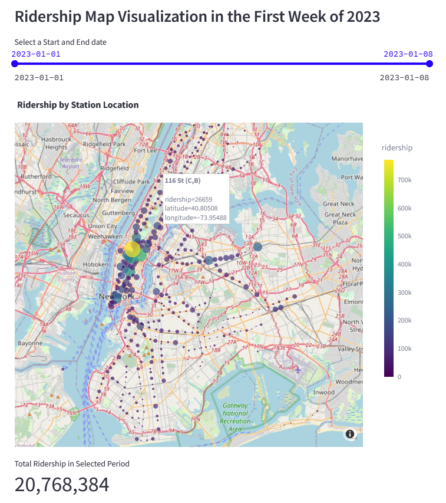

# MTA Subway Station Ridership Dashboard

## Overview

This project is part of the **MTA Open Data Challenge**, inviting community members, developers, and data enthusiasts to utilize MTA's open datasets in creative ways. This dashboard leverages MTA's ridership data to provide insights into subway station usage trends, comparisons, and predictions. Built using Streamlit, it offers an interactive experience to explore and analyze subway ridership over time.

## Features

### 1. Ridership Map Visualization
- **Tab 1**: Visualize subway ridership across stations on a map for the first week of January 2023.
- Allows users to select a date range and view the spatial distribution of ridership.
- Interactive map with hover details and zoom functionality.




### 2. Station Ridership
- **Tab 2**: View detailed ridership data over a selected date range.
- Users can choose specific stations or view aggregated data across all stations.
- Line charts display ridership trends, allowing for easy analysis of time-based changes.
- Total ridership for the selected period is displayed as a metric.

### 3. Station Comparison
- **Tab 3**: Compare ridership between two selected subway stations.
- Users can customize date and time ranges for each station.
- Side-by-side line charts offer a clear view of ridership trends between two stations.

### 4. Hourly Trends
- **Tab 4**: Analyze hourly ridership trends for a selected station.
- Displays the average ridership by hour of the day, helping identify peak times.
- Interactive line chart for a detailed view of hourly ridership patterns.

### 5. Ridership Prediction Using Prophet
- **Tab 5**: Predict hourly ridership using the **Prophet** time series model.
- Users can select a station to forecast future ridership trends.
- The model predicts ridership for the next 24 hours and visualizes both actual and forecasted data.
- Provides a detailed dataframe of predicted ridership data.

### 6. Ridership Prediction Using XGBoost
- **Tab 6**: Predict future hourly ridership using **XGBoost**, a powerful machine learning algorithm.
- Users can predict up to 24 or 168 hours into the future, starting from the latest data point.
- Displays three lines: actual, predicted, and future predictions for clear trend analysis.
- The results are presented in an interactive line chart and detailed data table.

## Technologies Used
- **Streamlit**: For building an interactive web application.
- **Pandas**: Data manipulation and analysis.
- **Plotly**: Interactive visualizations, including maps and line charts.
- **Prophet**: Time series forecasting.
- **XGBoost**: Machine learning model for predictive analysis.
- **Statsmodels**: For ARIMA models and statistical analysis.
- **NumPy**: Numerical operations and data transformations.

## Getting Started

1. **Clone the repository**:
   ```bash
   git clone https://github.com/your-username/mta-ridership-dashboard.git
   ```
2. **Install dependencies**:
   ```bash
   pip install -r requirements.txt
   ```
3. **Run the Streamlit app**:
   ```bash
   streamlit run streamlit_app.py
   ```

4. **Access the dashboard**:
   Open your browser and navigate to `http://localhost:8501` to explore the dashboard.

## Data Sources

- **MTA Open Data**: [data.ny.gov](https://data.ny.gov)
- The dashboard utilizes MTA's subway ridership data from **July 2020 to October 2024**.

## Contributing

Contributions are welcome! If you would like to suggest improvements or add new features, please open an issue or create a pull request.

## License

This project is licensed under the MIT License. See the `LICENSE` file for more details.

